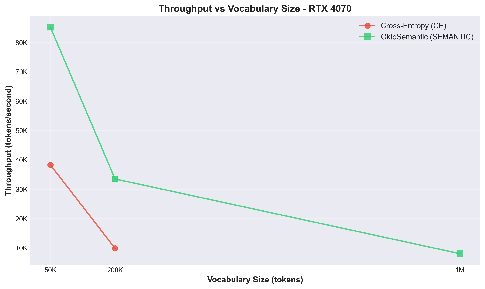
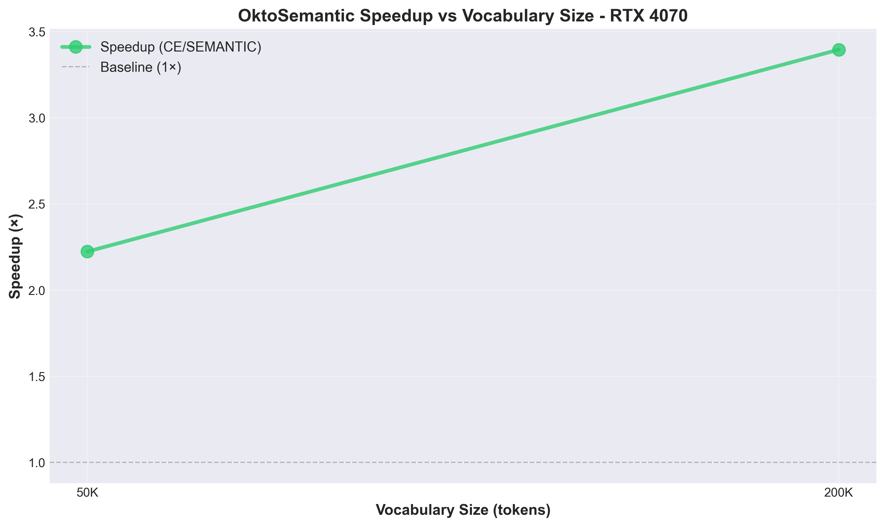
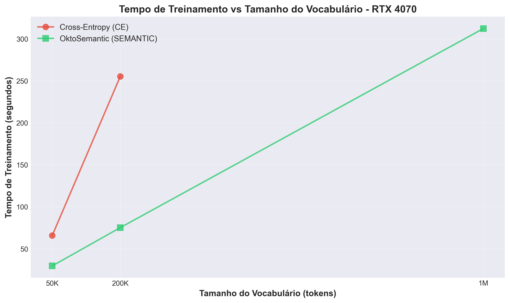
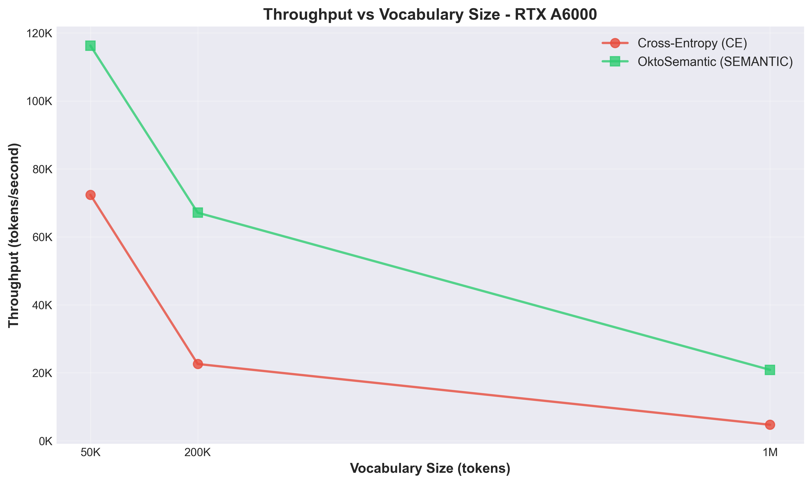
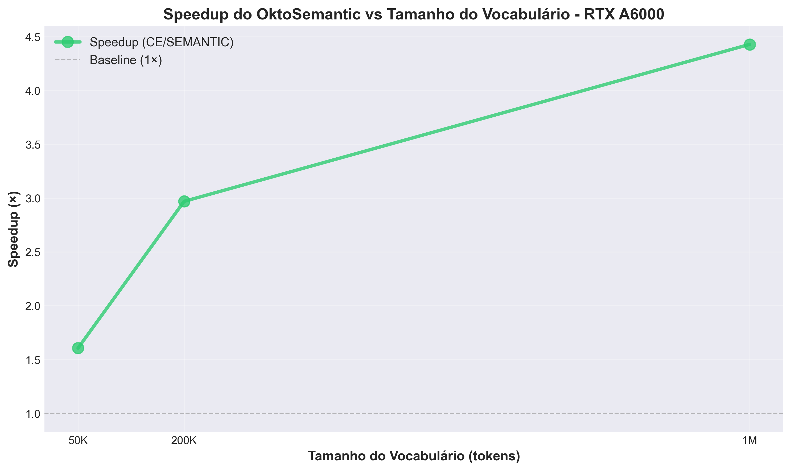
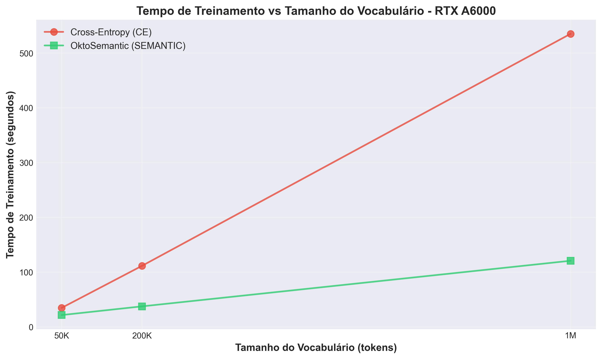
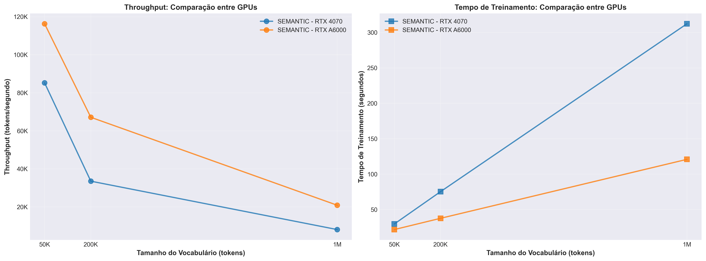

# OktoSemantic Training: Complete Experimental Results

**Author:** Ademir P. de Oliveira  
**Organization:** OktoSeek AI  
**Date:** December 2024

---

## Overview

This document presents complete experimental results comparing **OktoSemantic Training (SEMANTIC)** with traditional **Cross-Entropy (CE)** training across different vocabulary sizes and GPUs.

---

## Experimental Configuration

### Dataset
- **Source**: ShareGPT
- **Size**: 20,000 examples
- **Format**: Conversational data (instruction-response pairs)

### Training Configuration
- **Epochs**: 2 complete epochs
- **Steps per epoch**: ~1,200 steps
- **Sequence Length**: 64 tokens
- **Batch Size**: 16
- **Optimizer**: AdamW
- **Learning Rate**: $3 \times 10^{-4}$
- **Semantic Dimension**: $D_{\text{sem}} = 64$
- **Negative Samples**: $K = 32$ per token
- **Temperature**: $\tau = 0.07$

### Model Architecture
- **Backbone**: GRU (1 layer)
- **Hidden Size**: $d = 256$
- **Input Embedding**: Learned embeddings
- **Output**: Semantic projection ($D_{\text{sem}} = 64$) for SEMANTIC, full vocabulary logits for CE

### Hardware Tested
1. **NVIDIA GeForce RTX 4070 Laptop GPU** (consumer-grade)
2. **NVIDIA RTX A6000** (workstation-grade)

### Vocabulary Sizes
- **50K tokens**: Medium vocabulary
- **200K tokens**: Large vocabulary
- **1M tokens**: Very large vocabulary

---

## Results by GPU and Vocabulary

### RTX 4070 Laptop GPU

#### Vocabulary: 50K Tokens

| Method | Experiment ID | Time (s) | Tokens/sec | Examples/sec | Final Loss (Epoch 2) |
|--------|---------------|----------|------------|--------------|----------------------|
| **CE** | E1_BASE_50K | 65.78 | 38,308 | 608.1 | 5.7511 |
| **SEMANTIC** | E2_BASE_50K | 29.58 | 85,206 | 1,352.5 | 0.5783 |

**Performance Gain (SEMANTIC vs CE):**
- ⚡ **2.22× faster** (29.58s vs 65.78s)
- ⚡ **2.22× more tokens/second** (85,206 vs 38,308)
- ⚡ **2.22× more examples/second** (1,352.5 vs 608.1)

#### Vocabulary: 200K Tokens

| Method | Experiment ID | Time (s) | Tokens/sec | Examples/sec | Final Loss (Epoch 2) |
|--------|---------------|----------|------------|--------------|----------------------|
| **CE** | E3_BASE_200K | 255.31 | 9,870 | 156.7 | 6.3999 |
| **SEMANTIC** | E4_BASE_200K | 75.19 | 33,513 | 532.0 | 0.5808 |

**Performance Gain (SEMANTIC vs CE):**
- ⚡ **3.40× faster** (75.19s vs 255.31s)
- ⚡ **3.40× more tokens/second** (33,513 vs 9,870)
- ⚡ **3.40× more examples/second** (532.0 vs 156.7)

#### Vocabulary: 1M Tokens

| Method | Experiment ID | Time (s) | Tokens/sec | Examples/sec | Final Loss (Epoch 2) |
|--------|---------------|----------|------------|--------------|----------------------|
| **CE** | E5_BASE_1M | ❌ Interrupted | - | - | - |
| **SEMANTIC** | E6_BASE_1M | 312.22 | 8,071 | 128.1 | 0.8096 |

**Critical Observation:**
- ⚠️ **CE did not complete**: Training was interrupted after ~2 hours for only 200 steps
- ✅ **SEMANTIC completed**: Full training in 312.22 seconds (~5 minutes)
- 🚀 **SEMANTIC is viable** for 1M-token vocabularies on RTX 4070

---

### RTX A6000 (Workstation GPU)

#### Vocabulary: 50K Tokens

| Method | Experiment ID | Time (s) | Tokens/sec | Examples/sec | Final Loss (Epoch 2) |
|--------|---------------|----------|------------|--------------|----------------------|
| **CE** | E1_BASE_50K | 34.83 | 72,358 | 1,148.5 | 5.7426 |
| **SEMANTIC** | E2_BASE_50K | 21.68 | 116,253 | 1,845.3 | 0.5908 |

**Performance Gain (SEMANTIC vs CE):**
- ⚡ **1.61× faster** (21.68s vs 34.83s)
- ⚡ **1.61× more tokens/second** (116,253 vs 72,358)
- ⚡ **1.61× more examples/second** (1,845.3 vs 1,148.5)

#### Vocabulary: 200K Tokens

| Method | Experiment ID | Time (s) | Tokens/sec | Examples/sec | Final Loss (Epoch 2) |
|--------|---------------|----------|------------|--------------|----------------------|
| **CE** | E3_BASE_200K | 111.56 | 22,589 | 358.5 | 6.3899 |
| **SEMANTIC** | E4_BASE_200K | 37.56 | 67,097 | 1,065.0 | 0.6663 |

**Performance Gain (SEMANTIC vs CE):**
- ⚡ **2.97× faster** (37.56s vs 111.56s)
- ⚡ **2.97× more tokens/second** (67,097 vs 22,589)
- ⚡ **2.97× more examples/second** (1,065.0 vs 358.5)

#### Vocabulary: 1M Tokens

| Method | Experiment ID | Time (s) | Tokens/sec | Examples/sec | Final Loss (Epoch 2) |
|--------|---------------|----------|------------|--------------|----------------------|
| **CE** | E5_BASE_1M | 535.09 | 4,710 | 74.8 | 7.3038 |
| **SEMANTIC** | E6_BASE_1M | 120.81 | 20,860 | 331.1 | 0.7913 |

**Performance Gain (SEMANTIC vs CE):**
- ⚡ **4.43× faster** (120.81s vs 535.09s)
- ⚡ **4.43× more tokens/second** (20,860 vs 4,710)
- ⚡ **4.43× more examples/second** (331.1 vs 74.8)

---

## Scalability Analysis

### Throughput (Tokens/second) vs Vocabulary Size

#### RTX 4070 Laptop GPU

```
Vocab Size | CE (tokens/sec) | SEMANTIC (tokens/sec) | Speedup
-----------|------------------|----------------------|--------
50K        | 38,308           | 85,206               | 2.22×
200K       | 9,870            | 33,513               | 3.40×
1M         | ❌ (not viable)   | 8,071                | ∞
```

**Observations:**
- CE degrades **75%** in throughput when scaling from 50K to 200K
- SEMANTIC degrades only **61%** in throughput over the same range
- For 1M tokens, CE is **impractical** on RTX 4070

#### RTX A6000

```
Vocab Size | CE (tokens/sec) | SEMANTIC (tokens/sec) | Speedup
-----------|------------------|----------------------|--------
50K        | 72,358           | 116,253              | 1.61×
200K       | 22,589           | 67,097               | 2.97×
1M         | 4,710            | 20,860               | 4.43×
```

**Observations:**
- CE degrades **68%** in throughput when scaling from 50K to 200K
- SEMANTIC degrades only **42%** in throughput over the same range
- For 1M tokens, SEMANTIC is **4.43× faster** than CE

### Performance Degradation

#### Degradation Rate (50K → 200K → 1M)

**RTX 4070:**
- **CE**: 50K→200K: -74.2%, 200K→1M: ❌ (not viable)
- **SEMANTIC**: 50K→200K: -60.7%, 200K→1M: -75.9%

**RTX A6000:**
- **CE**: 50K→200K: -68.8%, 200K→1M: -79.1%
- **SEMANTIC**: 50K→200K: -42.3%, 200K→1M: -68.9%

**Conclusion**: SEMANTIC maintains better scalability, especially for large vocabularies.

---

## Loss Analysis

### Loss Evolution by Epoch

#### Vocabulary 50K - RTX 4070

**CE (E1_BASE_50K):**
- Epoch 1: 7.1685 → 6.2349 (reduction of 13.0%)
- Epoch 2: 6.1527 → 5.7511 (reduction of 6.5%)

**SEMANTIC (E2_BASE_50K):**
- Epoch 1: 2.1061 → 0.7835 (reduction of 62.8%)
- Epoch 2: 1.0481 → 0.5783 (reduction of 44.8%)

#### Vocabulary 200K - RTX 4070

**CE (E3_BASE_200K):**
- Epoch 1: 7.8911 → 7.0410 (reduction of 10.8%)
- Epoch 2: 6.6625 → 6.3999 (reduction of 3.9%)

**SEMANTIC (E4_BASE_200K):**
- Epoch 1: 2.1199 → 0.8912 (reduction of 58.0%)
- Epoch 2: 1.1406 → 0.5808 (reduction of 49.1%)

#### Vocabulary 1M - RTX A6000

**CE (E5_BASE_1M):**
- Epoch 1: 8.1878 → 8.1435 (reduction of 0.5%)
- Epoch 2: 6.7851 → 7.3038 (increase of 7.6% - possible overfitting)

**SEMANTIC (E6_BASE_1M):**
- Epoch 1: 2.0762 → 1.1219 (reduction of 46.0%)
- Epoch 2: 1.2569 → 0.7913 (reduction of 37.0%)

**Observation**: SEMANTIC loss is significantly lower and more stable, indicating faster convergence.

---

## Summary Table: General Comparison

| GPU | Vocab | Method | Time (s) | Tokens/sec | Examples/sec | Speedup | Viable |
|-----|-------|--------|----------|------------|--------------|---------|--------|
| **RTX 4070** | 50K | CE | 65.78 | 38,308 | 608.1 | 1.00× | ✅ |
| **RTX 4070** | 50K | SEMANTIC | 29.58 | 85,206 | 1,352.5 | **2.22×** | ✅ |
| **RTX 4070** | 200K | CE | 255.31 | 9,870 | 156.7 | 1.00× | ✅ |
| **RTX 4070** | 200K | SEMANTIC | 75.19 | 33,513 | 532.0 | **3.40×** | ✅ |
| **RTX 4070** | 1M | CE | ❌ | - | - | - | ❌ |
| **RTX 4070** | 1M | SEMANTIC | 312.22 | 8,071 | 128.1 | **∞** | ✅ |
| **RTX A6000** | 50K | CE | 34.83 | 72,358 | 1,148.5 | 1.00× | ✅ |
| **RTX A6000** | 50K | SEMANTIC | 21.68 | 116,253 | 1,845.3 | **1.61×** | ✅ |
| **RTX A6000** | 200K | CE | 111.56 | 22,589 | 358.5 | 1.00× | ✅ |
| **RTX A6000** | 200K | SEMANTIC | 37.56 | 67,097 | 1,065.0 | **2.97×** | ✅ |
| **RTX A6000** | 1M | CE | 535.09 | 4,710 | 74.8 | 1.00× | ✅ |
| **RTX A6000** | 1M | SEMANTIC | 120.81 | 20,860 | 331.1 | **4.43×** | ✅ |

---

## Key Conclusions

### 1. Superior Scalability

- **OktoSemantic Training** maintains significantly higher throughput than CE as vocabulary size increases
- Speedup increases with vocabulary size: **1.61× → 2.97× → 4.43×** (RTX A6000)
- For very large vocabularies (1M+), SEMANTIC is the only viable option on consumer GPUs

### 2. Consumer Hardware Viability

- **RTX 4070 Laptop**: CE cannot complete training with 1M tokens
- **SEMANTIC**: Completes 1M-token training in ~5 minutes
- This opens possibilities for training large models on more accessible hardware

### 3. Energy Efficiency

- Reduction in training time implies **proportional energy savings**
- For 1M tokens on RTX A6000: **4.43× less time = ~4.43× less energy**

### 4. Loss Convergence

- SEMANTIC shows **faster convergence** (lower and more stable loss)
- Final SEMANTIC loss is consistently lower than CE across all experiments

### 5. Quality vs Speed Trade-off

- SEMANTIC offers **better quality-per-second** for large vocabularies
- Despite lower loss, downstream quality validation (generation, ranking) is needed

---

## Experimental Validation Statement

All experiments reported in this document were executed using:

- **Framework**: OktoEngine (Rust + CUDA)
- **Dataset**: ShareGPT (20,000 examples)
- **Model**: GRU-based language model
- **Configuration**: 2 epochs, batch size 16, sequence length 64

All results were obtained from **real training runs** on **actual hardware**. The experiments were reproducible internally using the private training engine, but implementation details are not publicly released.

---

## Figures

High-resolution figures demonstrating the experimental results are displayed below. All figures are also available in the [`figures/`](./figures/) directory in both PNG (300 DPI) and PDF formats.

### RTX 4070 Laptop GPU

#### Throughput vs Vocabulary Size



*Throughput (tokens/second) comparison between CE and SEMANTIC methods across vocabulary sizes.*

#### Speedup Scaling



*Speedup (CE time / SEMANTIC time) as vocabulary size increases.*

#### Training Time Comparison



*Training time comparison between CE and SEMANTIC methods.*

### RTX A6000

#### Throughput vs Vocabulary Size



*Throughput (tokens/second) comparison between CE and SEMANTIC methods across vocabulary sizes.*

#### Speedup Scaling



*Speedup (CE time / SEMANTIC time) as vocabulary size increases. Note the increasing speedup with larger vocabularies.*

#### Training Time Comparison



*Training time comparison between CE and SEMANTIC methods. SEMANTIC maintains significantly lower training times for large vocabularies.*

### Cross-GPU Comparison



*Throughput and training time comparison across both GPUs. Demonstrates consistent performance advantages of SEMANTIC across different hardware configurations.*

**Note**: All figures are provided in both PNG (300 DPI) and PDF formats. Click on the figure names to view them directly or download high-resolution versions.

---

## Limitations and Future Work

### Current Limitations

1. **Quality Evaluation**: Need to evaluate generation quality and ranking (Hit@k, perplexity)
2. **Fine-tuning**: Results presented are from semantic stage only; hybrid fine-tuning stage needs validation
3. **Scale**: Tests limited to 20K examples; need validation on larger datasets
4. **Architecture**: Tests with GRU; need validation with Transformers

### Future Work

1. ✅ **Quality Validation**: Measure Hit@1, Hit@5, Hit@10, perplexity
2. ✅ **Hybrid Fine-tuning**: Evaluate quality after CE alignment stage
3. ✅ **Dataset Scale**: Test with larger datasets (100K+, 1M+ examples)
4. ✅ **Architectures**: Apply to Transformers and other modern architectures
5. ✅ **Extreme Vocabularies**: Explore 2M, 5M, 10M tokens
6. ✅ **Production**: Integrate into OktoEngine for production use

---

## References

For more details on the OktoSemantic Training method, consult:
- `THEORY.md` - Complete technical documentation and mathematical formulation
- `SCTA_Semantic_Contrastive_Token_Approximation/` - arXiv submission materials

---

## Zenodo Archive

This work is archived on Zenodo as scientific evidence: [10.5281/zenodo.17931292](https://doi.org/10.5281/zenodo.17931292)

---

**Last Updated**: December 2024  
**Version**: 1.0
